# cheapshot

On-device screenshot OCR for AI agents. Turns screenshots into **redacted text**
so agents read words instead of pixels.

Apple Vision framework. No network. No API cost. macOS only.

## Why

An image costs roughly `(width x height) / 750` tokens, and it stays in the
conversation, riding along on every later turn. The words are usually all the
agent needed. Measured on a real screenshot: **1,018 image tokens -> 37 text
tokens, 96% saved.**

Screenshots are also full of things you do not want in an agent's context.
`cheapshot` redacts by default.

## Install

```bash
make            # universal binary at ./cheapshot, macOS 13 or newer
make install    # copies it to /usr/local/bin (PREFIX=... to change)
```

Needs the Xcode command line tools. `swift test` runs the test suite.

## Use

```bash
cheapshot shot.png                 # OCR one file, redacted
cheapshot --cleanshot              # newest CleanShot capture
cheapshot --cleanshot 3            # newest three
cheapshot --newest ~/Desktop 2     # newest two in any folder
cheapshot --raw shot.png           # skip redaction
cheapshot --json shot.png          # structured output with redaction counts
cheapshot --stats shot.png         # token savings to stderr

cheapshot --video screen.mp4       # screen recording to a timestamped transcript
cheapshot --ledger                 # cumulative savings across every run
```

## Redaction

On by default. Ordered most-specific first so a key is never eaten by a looser
rule.

| Rule | Catches |
|---|---|
| `AWS_KEY` | AKIA/ASIA/AGPA/AIDA/AROA/ANPA + 16 |
| `GITHUB_PAT` | ghp_ gho_ ghu_ ghs_ ghr_ github_pat_ |
| `OPENAI_KEY` | sk-, sk-proj-, sk-ant-, sk-live- |
| `SLACK_TOKEN` | xoxb/xoxp/xoxa/xoxo/xoxs/xoxr |
| `JWT` | three base64url segments |
| `PRIVATE_KEY` | PEM header |
| `BEARER` | Authorization: Bearer ... |
| `EMAIL` | addresses; a scale suffix like `@2x.png` is not one |
| `SSN` | US, with invalid-prefix exclusions |
| `CARD` | 13-19 digits, **Luhn-validated** |
| `PHONE` | US formats |
| `ROUTING` | 9-digit ABA, **checksum-validated** |
| `BANK_ACCT` | 8 to 17 digits after an account cue (`acct`, `account`, `a/c`, `micr`) or a redacted routing number; bare digit runs survive |
| `TOKEN` | opaque mixed-case runs 20+ chars |
| `IPV4` | dotted quads |

### Known limit

OCR garbles long random strings (`0` -> `Ø`, `l` -> `I`). A garbled secret can
break a specific rule and survive as a fragment; the `TOKEN` catch-all exists to
sweep those up. Redaction is best-effort on OCR output, not a guarantee. Do not
point this at something whose secrets must never leak, and use `--raw` only when
you know what is in the frame.

## The other thing it is for

Cheapshot started as a way to spend fewer tokens. It turned out to also be the
only lawful way to hand an agent a page it is not allowed to fetch.

Bot protection fingerprints the TLS handshake and runs a JavaScript proof of
work. `curl` fails both, and every tool that defeats it is bot detection
evasion. So an agent asking for a retailer's live inventory, a bank statement,
an authenticated dashboard, an IPMI console, a native app with no API, or
anything behind a login is stuck, permanently, by design.

You are not stuck. You are allowed to see the page. You are looking at it.

```bash
cheapshot --cleanshot
```

The human is the credential. Cheapshot is the transport. Nothing is forged,
nothing is evaded, and no check is defeated. A person who is permitted to see
something reads it to their tools.

This is also why redaction is on by default. The pages worth doing this with
are the ones with account numbers on them.

## Video

`--video` is the same idea aimed at screen recordings. Agents normally read a
video by sampling frames and sending each one as an image, which costs thousands
of tokens per frame. Cheapshot instead asks ffmpeg for only the frames where the
screen actually changed, OCRs those locally, drops any screen nearly identical
to the one before it, and emits a timestamped transcript.

Measured on a 13 minute, 2.9 GB screen recording at 2560x1440: 12 scene frames,
**22,128 image tokens to 1,091 text tokens, 95% saved.**

Options: `--scene <f>` change threshold, default 0.25. `--max-frames <n>`,
default 200. `--dedupe <f>` drop a screen this similar to the last, default 0.90.

Requires ffmpeg on your PATH. Cheapshot uses whichever one you have.

## Ledger

Every run appends a line to `~/.claude/cheapshot-ledger/YYYYMMDD.tsv`:

```
2026-09-08T01:05:35Z	image	1	1550	54	1496	10
```

Time, mode, inputs, image tokens, text tokens, saved, redactions. `--ledger`
totals it. `--no-ledger` skips recording a run.

## Why there is no LLM in the pipeline

macOS 26 ships Apple's on-device Foundation Models, and the obvious move is to
pipe OCR text through it to compress or to catch PII that regex misses. It was
built and cut in the same hour. Measured on real input:

- **compression fabricated.** Given a screenshot of a 1Password dialog, the model
  appended an invented paragraph about a password-sharing feature that appeared
  nowhere on screen.
- **semantic redaction silently deleted words.** `SSN 123-45-6789` came back as
  `[SSN]` with the label gone; `github ghp_...` lost `github`.

The entire value of this tool is that the text it hands an agent is what was
actually on the screen. A layer that invents and deletes is worse than the tokens
it saves. Vision OCR plus deterministic regex it is.

## License

Business Source License 1.1. Use it, fork it, run it inside your company. You
may not ship it to third parties as a hosted, embedded, or packaged commercial
product or service without a commercial license.

**Free in full, no agreement needed:** schools and universities, students,
academic and non-commercial research, nonprofits, libraries, and anyone using it
personally or to learn. Hosting included. If you think you might qualify, you
do.

Converts to **MIT on 2030-09-07**.


## If you are not sure whether you owe anything

You probably do not. The free grants are real and they are meant to be generous.
Schools, students, researchers, nonprofits, libraries, and anyone using this
personally are covered completely, hosting included. Running Cheapshot inside
your own company is also free. If any of that is you, there is nothing to sign
and nobody to email.

One thing needs a license: selling it. That means offering Cheapshot, or
something built on it, to other people as a product, as a hosted service, or as
a part of something you charge for.

If that is you, the fix is a short email and a fair number. Terms flex a lot
depending on what you are building and who you are. Ask before you ship and it
stays easy.

If that is you and you do not ask, it becomes a different kind of conversation.
The terms are written down, copyright is enforceable, and the author has counsel
who handles this quickly and without drama. That path costs everyone more than
the email would have, and it is genuinely the outcome nobody here wants.

So use it freely if you are in the free group, and get in touch if you are not.
Both of those are easy, and only one of them involves lawyers.

### Commercial licensing



Scan it. That is the whole contact process.
